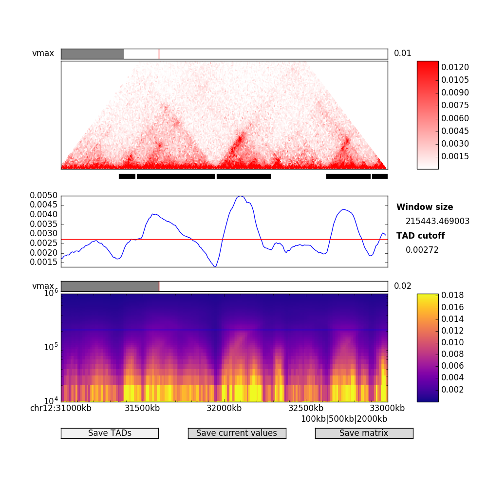
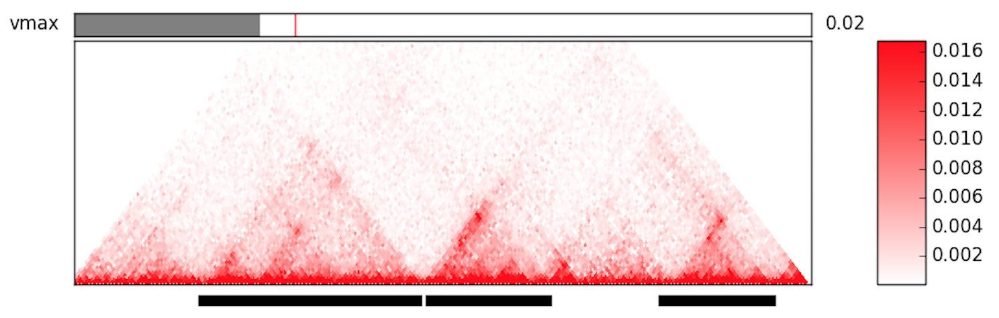
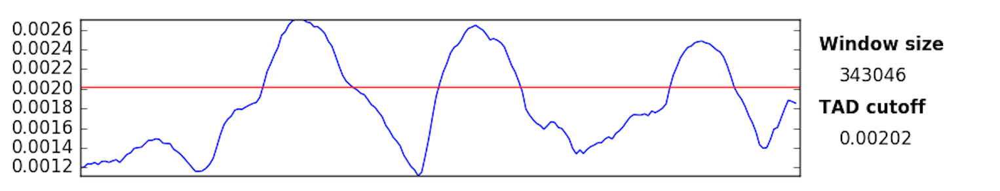
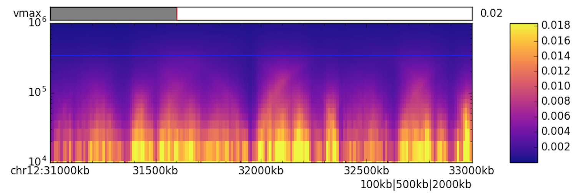

# TADtool

TADtool is an interactive tool for the identification of meaningful parameters in topologically-associating 
domains (TADs) algorithms for Hi-C data.



<!-- TOC depthFrom:1 depthTo:8 withLinks:1 updateOnSave:1 orderedList:0 -->

- [TADtool](#tadtool)
	- [Quick start](#quick-start)
	- [Installation](#installation)
	- [Usage](#usage)
		- [`plot`](#plot)
			- [Launching from the command line](#launching-from-the-command-line)
			- [Interactive plotting window](#interactive-plotting-window)
		- [`tads`](#tads)
		- [`subset`](#subset)

<!-- /TOC -->

## Quick start

TADtool is supported on Linux and macOS. It might work on Windows, but is unsupported. Installation:

```
pip install tadtool
```

Run sample data from [GitHub repo](https://github.com/vaquerizaslab/tadtool/):

```
tadtool plot examples/chr12_20-35Mb.matrix.txt examples/chr12_20-35Mb_regions.bed chr12:31000000-33000000
```

This should open the interactive plotting window (see above). Start exploring by clicking in plots - the effects 
should be self-explanatory.

## Installation

You can install TADtool from the command line using PyPI

```bash
pip install tadtool
```

or download the source from our [GitHub repo](https://github.com/vaquerizaslab/tadtool/) and install manually

```bash
python setup.py install
```

This should install both the Python package and a command-line executable called `tadtool`.

Test the installation running

```bash
tadtool -h
```

and you should see a brief help message.

## Usage

TADtool has three basic commands: `plot`, which invokes the plotting window, `tads`, which can be used to 
call TADs with predefined parameters, and `subset`, which can reduce a Hi-C matrix to a smaller region.

### `plot`

#### Launching from the command line

Here is the help output from `tadtool plot -h`:

```
usage: tadtool plot [-h] [-w WINDOW_SIZES [WINDOW_SIZES ...]] [-a ALGORITHM]
                    [-m MAX_DIST] [-n NORMALISATION_WINDOW] [-d DATA]
                    matrix regions plotting_region

Main interactive TADtool plotting window

positional arguments:
  matrix                Square Hi-C Matrix as tab-delimited or .npy file
                        (created with numpy.save) or sparse matrix format
                        (each line: <row region index> <column region index>
                        <matrix value>)
  regions               BED file (no header) with regions corresponding to the
                        number of rows in the provided matrix. Fourth column,
                        if present, denotes name field, which is used as an
                        identifier in sparse matrix notation.
  plotting_region       Region of the Hi-C matrix to display in plot. Format:
                        <chromosome>:<start>-<end>, e.g.
                        chr12:31000000-33000000

optional arguments:
  -h, --help            show this help message and exit
  -w WINDOW_SIZES [WINDOW_SIZES ...], --window-sizes WINDOW_SIZES [WINDOW_SIZES ...]
                        Window sizes in base pairs used for TAD calculation.
                        You can pass (1) a filename with whitespace-delimited
                        window sizes, (2) three integers denoting start, stop,
                        and step size to generate a range of window sizes, or
                        (3) more than three integers to define window sizes
                        directly. If left at default, window sizes will be
                        logarithmically spaced between 10**4 and 10**6, or
                        10**6.5 for the insulation and directionality index,
                        respectively.
  -a ALGORITHM, --algorithm ALGORITHM
                        TAD-calling algorithm. Options: insulation,
                        ninsulation, directionality. Default: insulation.
  -m MAX_DIST, --max-distance MAX_DIST
                        Maximum distance in base-pairs away from the diagonal
                        to be shown in Hi-C plot. Defaults to half the
                        plotting window.
  -n NORMALISATION_WINDOW, --normalisation-window NORMALISATION_WINDOW
                        Normalisation window in number of regions. Only
                        affects ninsulation algorithm. If not specified,
                        window will be the whole chromosome.
  -d DATA, --data DATA  Matrix with index data. Rows correspond to window
                        sizes, columns to Hi-C matrix bins. If provided,
                        suppresses inbuilt index calculation.
```

`plot` takes three mandatory (positional) arguments:

* A Hi-C matrix file, which can be
    * square matrix format: a tab-delimited text file that has the same number of columns as lines.
      Will be read internally by `numpy.loadtxt`
    * sparse matrix format: a tab delimited file where each line has three columns:
      \<row index\> \<column index\> \<value\>
    *  a numpy `.npy` file: created from a numpy matrix in Python with the `numpy.save` method 

> NOTE: It is possible to load large matrices at high resolution, but bear in mind that a 
  large matrix will consume more memory and may slow down TAD calculations. We recommend using 
  intra-chromosomal matrices of a single chromosome for the best experience. Alternatively, 
  it is possible to use several smaller sub-matrices to identify suitable TAD-calling parameters 
  in the interactive tool, and to call TADs on the whole matrix (or individual chromosome matrices) 
  using the non-interactive `tads` command (see below).

* A BED file with region information for the Hi-C matrix, i.e. a tab-delimited file where each row 
  contains chromosome name, start, and end coordinates (exclusive) of the region. This file must 
  not contain any headers. If a fourth column is present, it is assumed to be a unique identifier
  (index/name) for that region, which is then used to refer to that region in sparse matrix format
  (see above).

* A region selector string to inform TADtool about the region it is supposed to plot. The string 
  must be of the format `<chromosome>:<start>-<end>`, where `<end>` is inclusive. 
  Examples: `chr5:34000000-37000000`, `chrIX:300000-1000000`

When called with only these three arguments

```
tadtool plot /path/to/matrix.txt /path/to/regions.bed chr1:1000000-3000000
```

TADtool will calculate the insulation index for a range of automatically selected window sizes.

Optional arguments give you more control about the data that is generated:

* `-w` lets you define a custom range of window sizes, either as a file (`txt` or `npy`), a range, or specific values.

* `-a` lets you select the directionality index instead of the insulation index or, by using `ninsulation`, 
  the insulation index can be normalised to a chromosomal or region average.

* `-m` lets you specify a distance away from the Hi-C matrix diagonal that should be omitted from the plot.

* `-d` lets you bypass the TAD-calling calculation completely by providing a file with precomputed index data.

#### Interactive plotting window

After starting TADtool with the `plot` option as instructed above, the interactive plotting window will open.


The window consists of four parts: the Hi-C plot with bars indicating the currently called TADs, a line plot 
with the insulation or directionality index at the current window size, a heatmap with the insulation or 
directionality index for all specified window sizes, and a row of buttons to save the currently displayed data.

You can use the toolbar at the very bottom of the window to zoom and pan each plot (they will be synchronized) 
or to save the figure window in its current state.

##### Hi-C plot



This triangular plot shows a Hi-C map in the selected region from the command line. Use the slider on the 
top to adjust the color intensity as appropriate. On the bottom you will find bars that indicate the currently 
called TADs as calculated with the selected parameters.

##### Index plot



This plot shows the insulation or directionality index for each region in the Hi-C matrix at the currently 
selected window size. The red line(s) indicate the cutoff that is used to call TADs in this plot. Clicking 
within the plotting area moves the cutoff and simultaneously recalculates the TADs with the new cutoff. 
By default, for non-symmetric indexes (insulation index), the cutoff is set directly between the maximum 
and minimum of the y axis. For symmetric indexes (ninsulation, directionality), the cutoff is set to +/- half 
the maximum of the y axis.

##### Heatmap



The heatmap shows all insulation/directionality indexes for each specified window size simultaneously in a 
condensed form. Every row corresponds to one window size. A red bar indicates the currently chosen window size. 
Clicking within the plotting area changes the current window size and updates the index plot and TAD indicators. 
By default, the window size is set to the middle of all calculated window sizes.

##### Export buttons


At the bottom of the plotting window you will find three buttons that allow you to export TADs, index data, and 
the index matrix, respectively. Exported values are calculated for the whole supplied matrix, not just the 
visible region.

### `tads`

This command allows the calculation of TADs directly using one of the provided algorithms. This may be useful for 
quick TAD calculations when parameters are already known, or to fine-tune parameters estimated from the main 
TADtool plot. Here is the help output from `tadtool tads -h`:

```
usage: tadtool tads [-h] [-a ALGORITHM] [-n NORMALISATION_WINDOW] [-v]
                    matrix regions window_size cutoff [output]

Call TADs with pre-defined parameters

positional arguments:
  matrix                Square Hi-C Matrix as tab-delimited or .npy file
                        (created with numpy.save) or sparse matrix format
                        (each line: <row region index> <column region index>
                        <matrix value>)
  regions               BED file (no header) with regions corresponding to the
                        number of rows in the provided matrix. Fourth column,
                        if present, denotes name field, which is used as an
                        identifier in sparse matrix notation.
  window_size           Window size in base pairs
  cutoff                Cutoff for TAD-calling algorithm at given window size.
  output                Optional output file to save TADs.

optional arguments:
  -h, --help            show this help message and exit
  -a ALGORITHM, --algorithm ALGORITHM
                        TAD-calling algorithm. Options: insulation,
                        ninsulation, directionality. Default: insulation.
  -n NORMALISATION_WINDOW, --normalisation-window NORMALISATION_WINDOW
                        Normalisation window in number of regions. Only
                        affects ninsulation algorithm. If not specified,
                        window will be the whole chromosome.
  -v, --write-values    Write index values to file instead of TADs.
```

As `plot`, `tads` needs a Hi-C matrix and a regions BED file as input. In addition, it requires a window size 
in base pairs and a cutoff (floating point). Optionally, the user can specify an output file to save TAD regions, 
otherwise TADs will be written to the command line. Use `-v` to write the insulation score or directionality index 
for each regon instead of the TAD calls. For further parameters, see `plot`.

### `subset`

This is a convenience command that can extract submatrices from Hi-C matrices. Uses this if your matrix is so big 
that it slows down the plotting window or TAD calling. Here is the help output: `tadtool subset -h`:

```
usage: tadtool subset [-h]
                      matrix regions sub_region output_matrix output_regions

Reduce a matrix to a smaller region.

positional arguments:
  matrix          Square Hi-C Matrix as tab-delimited or .npy file (created
                  with numpy.save) or sparse matrix format (each line: <row
                  region index> <column region index> <matrix value>)
  regions         BED file (no header) with regions corresponding to the
                  number of rows in the provided matrix. Fourth column, if
                  present, denotes name field, which is used as an identifier
                  in sparse matrix notation.
  sub_region      Region of the Hi-C matrix to display in plot. Format:
                  <chromosome>:<start>-<end>, e.g. chr12:31000000-33000000
  output_matrix   Output matrix file.
  output_regions  Output regions file.

optional arguments:
  -h, --help      show this help message and exit
```